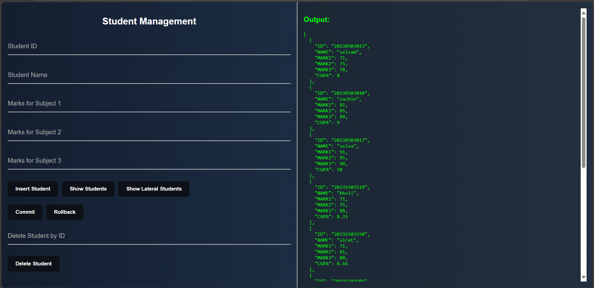

# 🎓 Student Management System

This is a full-stack Student Management System built using **React**, **Node.js (Express)**, and **Oracle DB**. It allows you to insert, view, delete, commit, and rollback student records with an interface styled like an online compiler.

---

## 🔧 Tech Stack

- **Frontend**: React (with Vite)
- **Backend**: Node.js, Express
- **Database**: Oracle DB

---

## 🚀 How to Run

### ▶️ Backend

```bash
cd backend
npm install
node server.js

⚠️ Make sure Oracle DB is running and credentials are configured properly in db.js.

💻 Frontend
cd frontend
npm install
npm run dev

```
📸 Screenshot


